# CROWN Shopping

_Responsive, multi-language e-commerce web app_

<br />

## How to Run

```sh
 yarn install
 yarn dev
```

## Description

Please kindly note that the project is under-development. I am working on it on my spare time.

- It has mobile-first approach.
- It has English and German languages which gives the ability to switch between these languages easily.
- It uses GraphQL API of commercetools.
- With sign in and sign up functionalities, it is possible to create an account with commercetools backend.

## Tech Stack

- React, Typescript, Next.js, GraphQL, Apollo, Styled Components, React Bootstrap.

## Demo

### Mobile

<p float="left">
  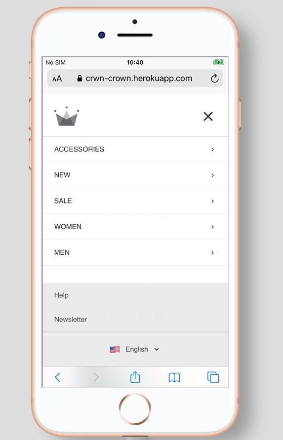
  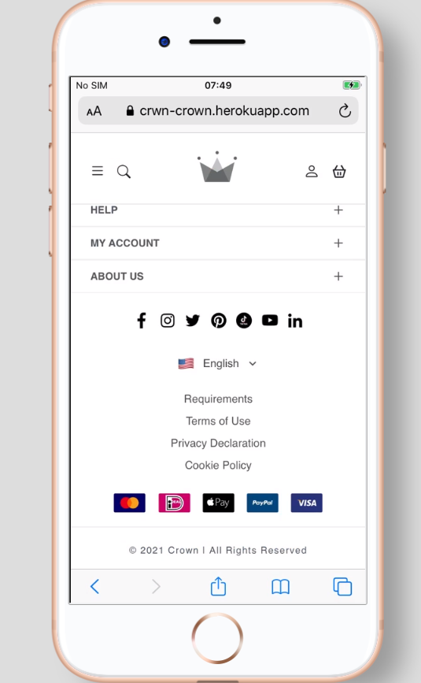 
</p>
<br/>
<p float="left">
  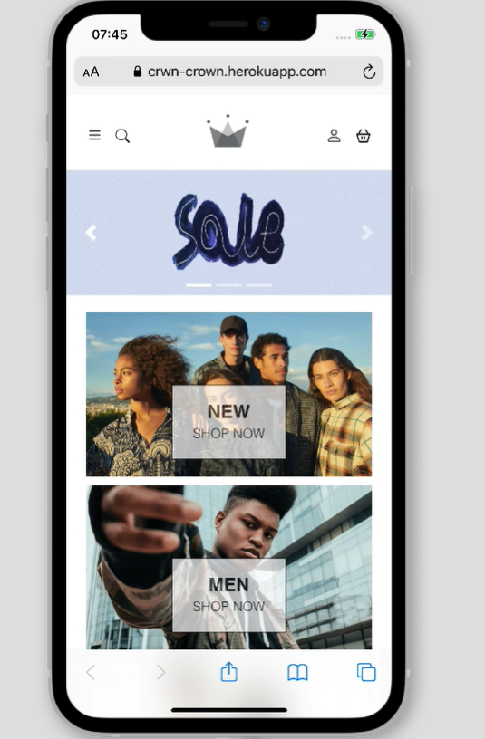
  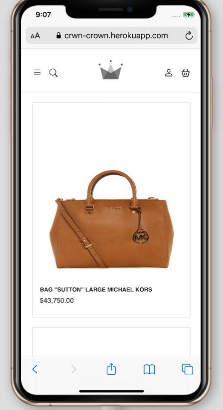 
</p>
<br/>
<p float="left">
  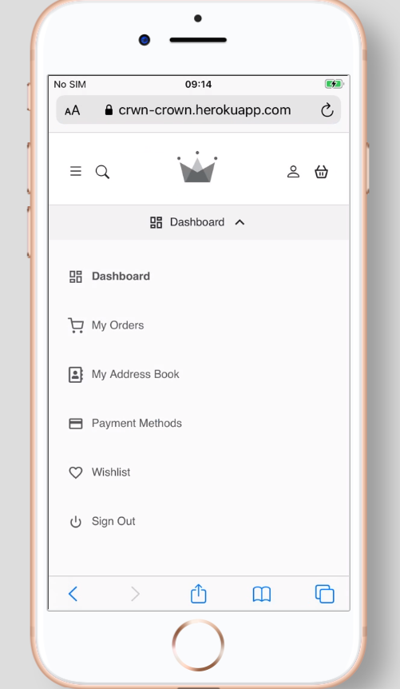 
  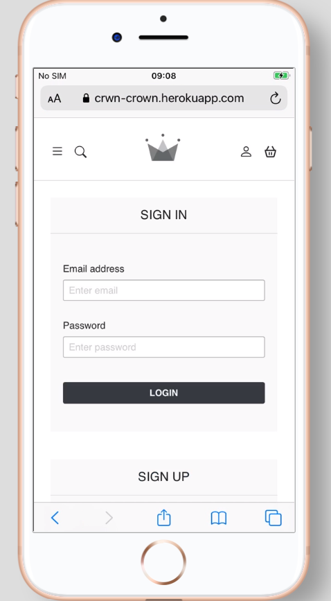
</p>

### Desktop

<p>
  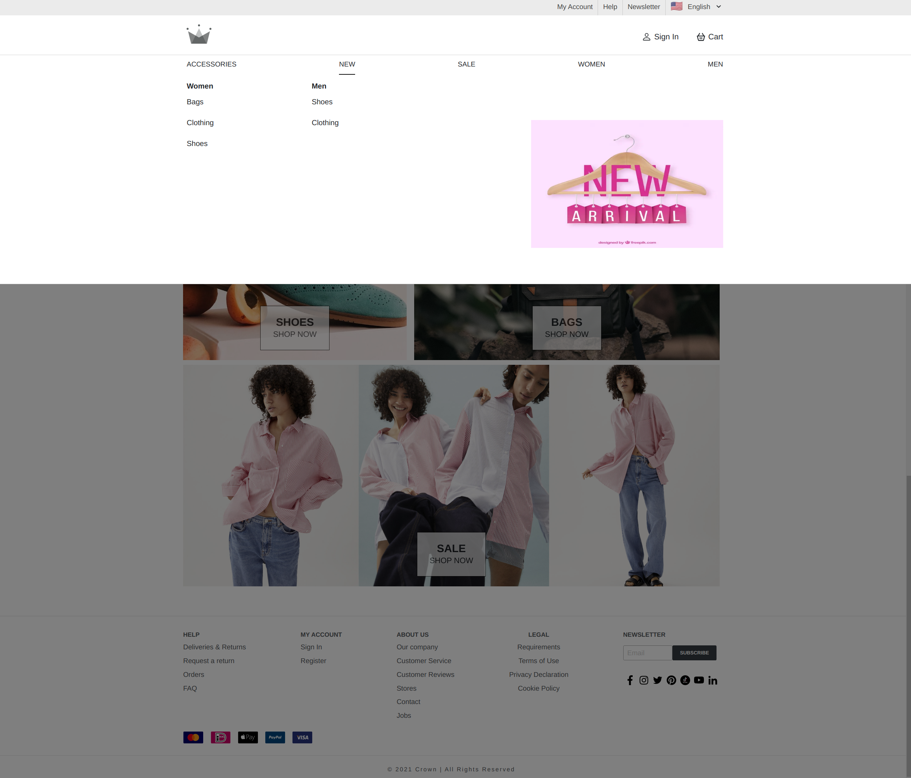
</p>
<br/>
<p>
  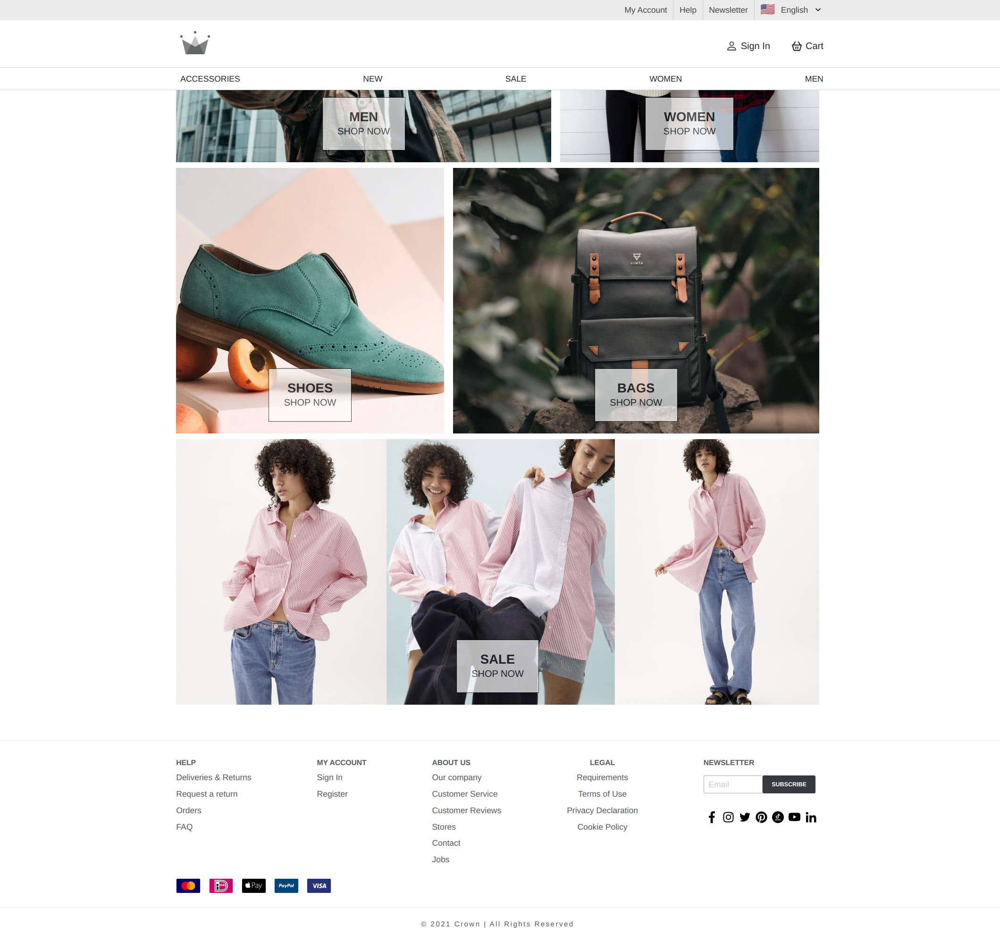
</p>
<br />
<p>
  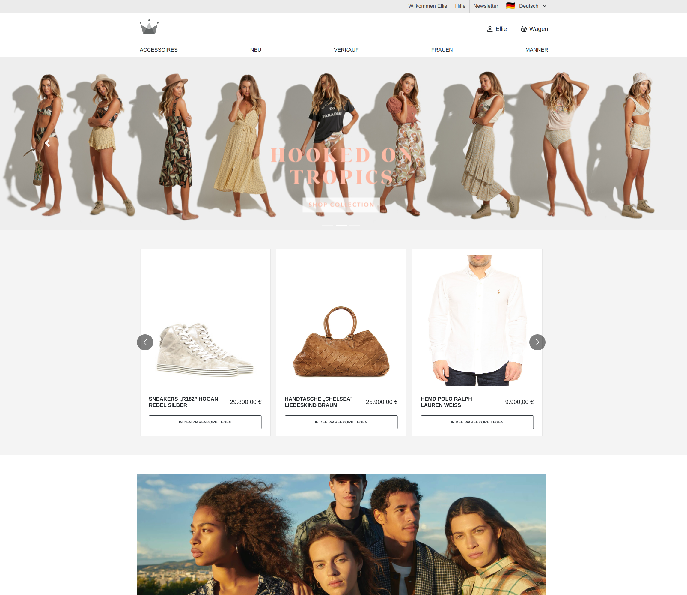
</p>
<br />
<p>
  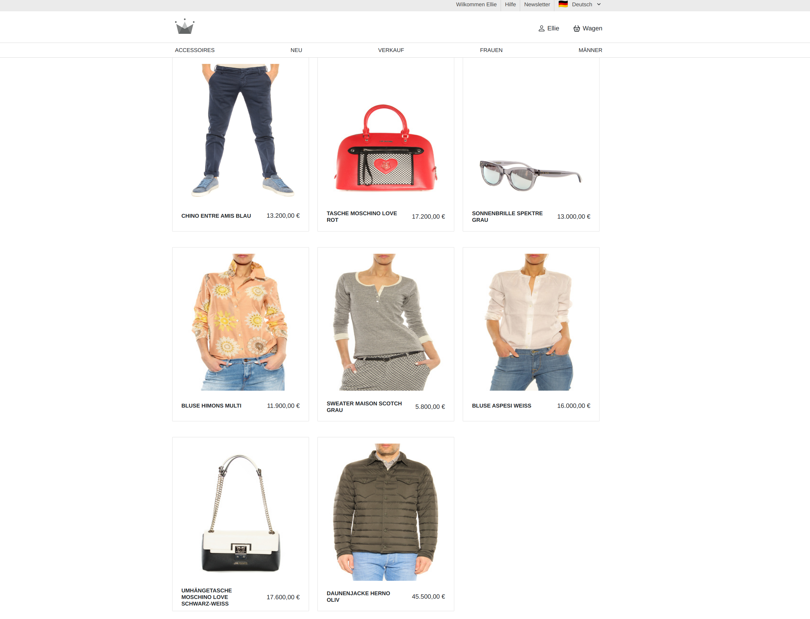
</p>
<br />
<p>
  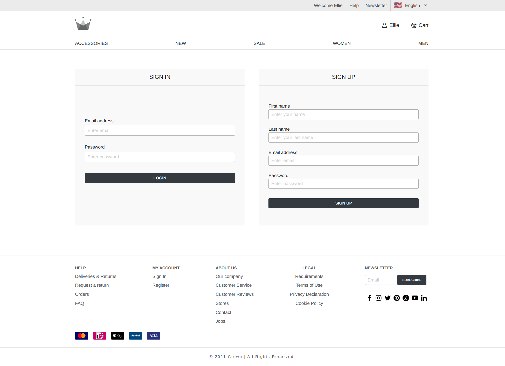
</p>
